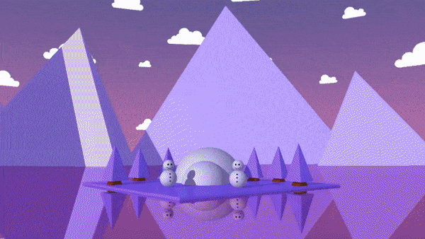

# Raytracing CUDA
Implementation of raytracing alghorithm using CUDA for calculating pixel colors and OpenGL for displaying results in real time.

## Features
- Real time raytracing on all CUDA enabled graphic cards
- FXAA anti-aliasing implementation
- Low poly models
- Interactive camera
- Manual and automatic time of day control

Mountains             |  Frozen Island
:-------------------------:|:-------------------------:
  |  

## Requirements
- CUDA enabled GPU (RTX card not needed)

## Project Setup
- Before running, switch to **Release** and **x64** configuration in Visual Studio

## Controls

#### Camera

- **Mouse**: change camera view
- **W, A, S, D**: translate camera
- **Q, E**: move camera up and down
- **V, B**: enable/disable anti-aliasing
- **🠙, 🠛**: change sea level
- **5**: island view
- **6**: mountains view

#### Time
- **O, P**: enable/disable automatic time
- **🠘, 🠚**: manual time control
- **1**: morning scene
- **2**: afternoon scene
- **3**: evening scene
- **4**: night scene

